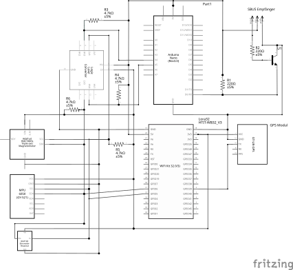
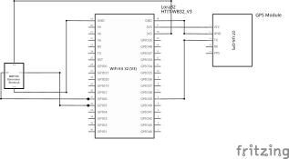
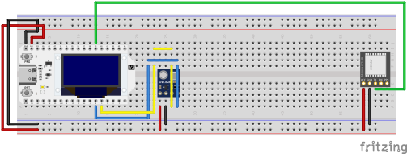

# Auto Flight

Autonomous glider for area-coverage flights — technical documentation.

"Auto Flight" is an autonomous glider that independently flies over predefined areas (e.g. agricultural fields) in a lawn-mower (meander) pattern. Navigation is achieved through a combination of GPS, accelerometer/gyroscope (IMU), magnetometer, and barometer. Throughout the flight, the plane stays in contact with a ground station via a long-range radio link (LoRa), which provides a web interface for mission planning and live monitoring. In an emergency, the plane can be taken over manually at any time via an off-the-shelf RC transmitter.

The system consists of three independent firmware/software projects (the flight controller in the plane, the ground station, and a servo/motor controller) as well as a number of shared components and tools:

| Project | Platform | Task |
|---|---|---|
| [`flight_controller/`](./flight_controller) | ESP-IDF (ESP32-S3) | Main computer in the plane: route planning, sensors, flight control, LoRa communication |
| [`base_station/`](./base_station) | ESP-IDF (ESP32-S3) | Ground station: WiFi access point, web UI server, LoRa relay |
| [`motor_controller/`](./motor_controller) | PlatformIO/Arduino (ATmega328) | Control-surface/motor actuation, SBUS reception, safety override |
| [`frontend_web/`](./frontend_web) | Vue 3 + TypeScript | Ground station user interface (mission planning, live telemetry) |
| [`shared_components/`](./shared_components) | ESP-IDF components | Shared building blocks for flight controller and ground station (LoRa, I2C, sensor drivers, data storage) |

The project is an individual student project in the "Mobile Robots" module and is currently at the stage of an advanced prototype. An ongoing development log with progress and issues encountered can be found in [`resources/learning.md`](./resources/learning.md).

# Objective and application scenario

## Basic idea

The starting point of the project (see [`Projekt_Idee.md`](./Projekt_Idee.md)) is an autonomous glider that flies over defined areas. The version implemented as part of this work covers the beginning of this scenario: communication with the ground station, configuration, and monitoring of the flight. The plane is already able to compute a route from the given area and make small corrections during the flight based on the accelerometer. However, flying the route is not yet fully autonomous, since altitude control and thrust control have not yet been flight-tested.

## Application scenario

The system is designed for use in mapping and agriculture. With the addition of a camera, the system could be used to inspect large areas (e.g. agricultural fields, solar parks, forests). The ground station allows planning of the area to be flown over, monitoring of the flight, and evaluation of the sensor data. The system is intended for use in rural areas with low building density and no no-fly zones.

## Bandwidth and data-storage concept

Since LoRa only offers very low bandwidth at long range, the radio link is deliberately limited to compact status and control data (position, sensor values, routes, connection status). Larger payloads such as camera images are, in the original idea, intended for local storage (SD card) or WiFi transfer after landing, and are deliberately not part of the LoRa link. This part is not implemented in the current feature set, since no camera payload has been integrated.

# Requirements and constraints

## Functional requirements

- Autonomous navigation along a strip pattern (waypoint sequence) computed from a user-defined polygon
- Determination of position, attitude (roll/pitch), heading, and altitude during flight from GPS, IMU, magnetometer, and barometer
- Remote configuration of the target area and monitoring of the flight via a web interface, reachable through a WiFi access point provided by the ground station
- Telemetry transmission (position, key sensor data, connection status, route) over a long-range radio link between plane and ground station
- Manual override of control surfaces and propulsion at any time via an RC transmitter, independent of the state of the flight controller

## Non-functional requirements and constraints

- **Range vs. bandwidth:** The radio link must work reliably even over larger distances (field size). This requires choosing LoRa (868 MHz, ISM band), with correspondingly low usable data rate, which necessitates a custom, frugal message protocol (see section "Technical implementation").
- **Real-time capability:** Flight control runs with a fixed cycle time of 50 ms in order to respond promptly to changes in attitude and heading.
- **Resource constraints:** As a glider, weight is a limiting factor for battery capacity, sensors, and servos. This limits both the available compute power (microcontroller instead of single-board computer) and the number of I2C sensors that can be operated simultaneously on a shared bus.
- **Fail-safety:** Manual override must not depend on the state of the flight controller, since the flight controller itself is the actual failure source it is meant to guard against.
- **Legal framework:** During the project, research into the legal framework for autonomous aircraft was carried out (see week 2 in [`resources/learning.md`](./resources/learning.md)), which in particular confirmed the need for manual control to be available at all times.

## Technical constraints

- Two identical Heltec WiFi LoRa 32 V3 boards (ESP32-S3 + integrated SX1262 LoRa module) as the central compute and radio units, one in the plane and one in the ground station
- An Arduino Nano (ATmega328) as a separate, simple servo/motor controller, connected via I2C to the flight controller and via SBUS to the RC receiver
- ESP-IDF (version 5.x) as the firmware base for the flight controller and ground station, with shared components in [`shared_components/`](./shared_components)
- Node.js/Vue 3 for the web interface, which is embedded as static files into the ground station's flash storage (no separate web server)

# System architecture

## Hardware architecture

### Main components

| Component | Location | Function |
|---|---|---|
| Heltec WiFi LoRa 32 V3 (ESP32-S3 + SX1262) | Plane, ground station (2×) | Main computer + LoRa radio module |
| Arduino Nano (ATmega328) | Plane | Servo/motor actuation, SBUS reception, safety override |
| GPS module (ATGM336H, NMEA) | Plane (ground station optional) | Position determination |
| MPU6050 (accelerometer + gyroscope) | Plane | Attitude determination (roll/pitch) |
| Magnetometer HMC5883L | Plane | Heading determination |
| Barometer (BME280) | Plane, ground station | Altitude determination via air pressure |
| Level shifter (3.3 V <-> 5 V) | Plane | I2C level adaptation between ESP32-S3 (3.3 V) and Arduino Nano (5 V) |
| Time-of-flight sensor TOF200C | Plane | Ground-distance measurement, intended for automatic landing |
| SBUS receiver | Plane | Reception of RC transmitter commands |
| 4× servo / ESC | Plane | Ailerons (differential), elevator, thrust, rudder |
| LittleFS storage | Ground station | Storage of the web UI files in flash |
| Batteries | Plane, ground station | Power supply |

The complete bill of materials can be found in [`BOM.md`](./BOM.md). The TOF200C distance sensor is part of the procurement list, but is not yet integrated into the firmware in the current feature set, since automatic landing, as described in the section "Known limitations and possible improvements", has not yet been implemented.

The magnetometer originally used was a QMC5883P, which was replaced with an HMC5883L during the project. Both associated datasheets are available under [`resources/`](./resources); the reason for the switch is explained in the section "Technical implementation and key design decisions".

### Schematics

The schematics for the plane and ground station were originally created with [Fritzing](https://fritzing.org/). The source files are available as [`hardware/circuits/fritzing_source/schematics_plane.fzz`](./hardware/circuits/fritzing_source/schematics_plane.fzz) and [`hardware/circuits/fritzing_source/schematics_base.fzz`](./hardware/circuits/fritzing_source/schematics_base.fzz), together with custom Fritzing parts created for modules without official Fritzing support ([BMP280 breakout](./hardware/circuits/fritzing_source/BMP280_Breakout_Board.fzpz), [GT-U8 GPS module](./hardware/circuits/fritzing_source/GT-U8-GPS-module.fzpz), [Heltec WiFi Kit 32 (V3)](./hardware/circuits/fritzing_source/Heltec%20WiFi%20Kit%2032%20(V3).fzpz)).

Since Fritzing is no longer maintained, the design was also converted into KiCad projects: [`hardware/circuits/plane_pcb/`](./hardware/circuits/plane_pcb/) and [`hardware/circuits/base_station_pcb/`](./hardware/circuits/base_station_pcb/), covering both schematic capture and PCB footprint placement. There's no reliable automated Fritzing→KiCad converter, so this used a custom extraction pipeline (documented in [`hardware/circuits/tools/README.md`](./hardware/circuits/tools/README.md)) that rebuilds the netlist from the Fritzing source and generates the KiCad files from it. A few things to know before treating the KiCad projects as finished: symbols are placed on a plain auto-generated grid rather than a hand-arranged layout (both schematic and PCB), the PCB has no copper routing yet (only correct net assignments/ratsnest), and several breakout-board footprints use generic pin headers with dimensions noted as estimated where not confirmed from a datasheet — see the tooling README's "Known limitations" section for the full list before ordering boards.

The wiring of the 4 servos is not shown in the schematic here, in order to keep it clear. The servos are connected directly to the Arduino Nano, which generates the PWM signals. PWM pins 9, 10, 11, and 12 were used for the left aileron, right aileron, elevator, and rudder. The mapping between servo and control surface is defined in the control logic in the ESP32 flight controller and can be adjusted as needed. In the Arduino code there is a fixed mapping: byte 0 -> servo 1, byte 1 -> servo 2, byte 2 -> servo 3, byte 3 -> servo 4. Which servo is assigned to which control surface is then defined in the flight control logic in the ESP32 flight controller.

**Plane:**




**Ground station:**





### Mechanical design

Under [`3d_models/`](./3d_models) are the 3D-printed enclosure/mounting designs:

- **Ground station enclosure** ([`base_station_case.scad`](./3d_models/base_station_case.scad)): a two-piece enclosure (tray + lid) with a snap-fit connection, mounts for the main board (Heltec LoRa32 V3 + GPS module) and a daughterboard connected via cable (barometer), an SMA antenna feedthrough in the enclosure wall, and a pressure-equalization hole in the lid above the barometer.
- **Plane mounting plate** ([`plane_mount_plate.scad`](./3d_models/plane_mount_plate.scad)): according to a comment in the source code, a pure layout mockup showing the relative arrangement of the main board, two daughterboards, and the four control-surface servos. It is explicitly not a flight-worthy part (no fuselage mounting, no cable routing, no weight optimization).

### System topology


The control surfaces can be actuated via the servos either by the flight controller (over I2C) or directly by the RC transmitter (over SBUS). Which path is active is decided exclusively by the Arduino in the plane (see "Manual override").

## Software architecture

### Project structure

| Path | Content |
|---|---|
| [`flight_controller/`](./flight_controller) | ESP-IDF firmware of the plane: route planning, sensors, flight control, LoRa communication |
| [`base_station/`](./base_station) | ESP-IDF firmware of the ground station: WiFi AP, web UI server, LoRa relay |
| [`motor_controller/`](./motor_controller) | Arduino firmware for servo/SBUS integration |
| [`frontend_web/`](./frontend_web) | Vue 3 web interface of the ground station |
| [`shared_components/`](./shared_components) | ESP-IDF components shared between flight controller and ground station (LoRa, I2C, sensor drivers, data storage) |
| [`python/`](./python) | Offline visualization of the computed flight routes |
| [`serial_plane_viz/`](./serial_plane_viz) | Tool for visualizing servo deflections over the serial interface |
| [`doc/`](./doc), [`resources/`](./resources) | Notes, pinouts, datasheets, bill of materials, development log |

`flight_controller` and `base_station` are two independent ESP-IDF projects, each with its own `sdkconfig`/`CMakeLists.txt`, both of which include the same components from `shared_components/` via `EXTRA_COMPONENT_DIRS`. This is the project's central reuse strategy: sensor drivers, I2C management, the LoRa radio stack, and the application protocol exist only once and are shared by both firmware projects, controlled via a project-wide compile flag (`FLIGHT_DEVICE_TYPE_PLANE` or `FLIGHT_DEVICE_TYPE_BASE_STATION`), which determines which role a device takes on in the protocol.
`motor_controller` is a standalone Arduino project that communicates with the flight controller over I2C and drives the control-surface servos and the motor. It is deliberately kept simple, since its only task is to move the servos and receive the SBUS signals from the transmitter.

### Communication layers

The connection between plane and ground station is split into three layers:

1. **Radio layer** ([`shared_components/lora_com`](./shared_components/lora_com)): controls the SX1262 radio module via the RadioLib library. Since a LoRa packet is limited to 255 bytes, this layer implements its own fragmentation of larger messages (header with message ID, fragment ID, and total fragment count), acknowledgement of each fragment via ACK with a timeout (2 s) and up to three retries, as well as periodic keep-alive pings (default: every 30 s) to monitor the connection in case no other message is sent.
2. **Application protocol** ([`shared_components/flight_com`](./shared_components/flight_com)): defines typed packets on top of the radio layer, including `SensorUpdate` (air pressure, heading), `PositionUpdate` (GPS position), `ComponentStatus` (connection status of the individual subsystems, override status, flight state), `PlannedRoutePacket`/`PlannedAreaPacket` (computed route / given area), and `FlightHistoryPacket` (flown path).
3. **Web link** (ground station -> browser): the ground station does not directly forward the received LoRa packets, but instead writes them into a central, thread-safe state store (`FlightStorage`, part of [`shared_components/flight_data`](./shared_components/flight_data)). An HTTP/WebSocket server reads from it and serializes the data separately as JSON for the web frontend. The LoRa format and the web JSON format are thus fully decoupled.

### Ground station web stack

The ground station opens a WiFi AP (default SSID, configurable via Kconfig, alternatively a "dev mode" in which it first tries to connect to an existing WiFi network instead) as well as an HTTP server. This serves:

- **Static files** of the web interface from a LittleFS flash partition (`/*` route as a fallback handler). The directory `base_station/static` is a symlink to `frontend_web/dist`, so that a frontend build is directly embedded as a flash image (`littlefs_create_partition_image` in [`base_station/CMakeLists.txt`](./base_station/CMakeLists.txt)).
- **REST API endpoints**: including `GET /api/status` (connection status), `POST`/`GET /api/area` (set/read target area), `GET /api/route` (query computed route). See "Ground station API reference" below for details.
- **WebSocket endpoint** (`GET /api/ws`): sends three message types to all connected clients every 5 seconds: `flight` (positions, planned/flown route), `connection` (connection status of all subsystems), `sensor` (air pressure, computed altitude, heading). Details below.

### Ground station API reference

All HTTP and WebSocket endpoints are registered in the ESP-IDF component [`base_station/components/frontend`](./base_station/components/frontend) (`FrontendHandlerClass::init()`), not in `base_controller`. At startup, `httpd_start` is called first, then the LittleFS partition is mounted, and finally the handlers are registered in a fixed order: `/api/ping`, `/api/ws`, the remaining REST endpoints, and finally the static file handler `/*`. This order is necessary because `/*`, as a wildcard, would otherwise shadow all more specific routes. In parallel, a FreeRTOS task starts that sends status packets via WebSocket every 5 seconds.

#### Data types

All endpoints exchange JSON, which is (de)serialized directly from the C++ structs in [`FrontendPackets.hpp`](./base_station/components/frontend/FrontendPackets.hpp) via `nlohmann::json`. The types in the frontend ([`frontend_web/src/types/`](./frontend_web/src/types)) mirror the same structures in TypeScript:

```ts
type Coordinate = { longitude: number; latitude: number }
type Route = Coordinate[]

type ConnectionState = "connecting" | "connected"
type FlightState = "planning" | "planned" | "flying" | "returning"

interface AreaDefinePacket {
  shape: Coordinate[]
}

interface PlannedRoutePacket {
  type: "plannedRoute"
  route: Coordinate[]
}

interface ConnectionUpdatePacket {
  type: "connection"
  baseConnectionState: ConnectionState
  lastContactBaseStationTimestamp: number
  planeConnectionState: ConnectionState
  lastContactPlaneTimestamp: number
  gpsConnectionBase: ConnectionState
  gpsConnectionPlane: ConnectionState
  barometerConnectionBase: ConnectionState
  barometerConnectionPlane: ConnectionState
  motorComConnectionPlane: ConnectionState
  magnetometerConnectionPlane: ConnectionState
  accelerometerConnectionPlane: ConnectionState
  manualOverridePlane: boolean
  flightState: FlightState
}

interface FlightUpdatePacket {
  type: "flight"
  basePosition: Coordinate
  basePositionUpdateTime: number
  planePosition: Coordinate
  planePositionUpdateTime: number
  flightRoute: Route
  flightRouteUpdateTime: number
  plannedRoute: Route
  plannedRouteUpdateTime: number
}

interface SensorUpdatePacket {
  type: "sensor"
  barometerPressureBase: number
  barometerPressurePlane: number
  calculatedAltitude: number
  headingPlane: number
}
```

`...Timestamp`/`...UpdateTime` fields are Unix timestamps, originating either from runtime or from the GPS signal. `ConnectionState`/`FlightState` are serialized as strings rather than numbers.

#### Endpoints

| Method | Path | Function | Type |
|---|---|---|---|
| GET | `/api/ping` | Liveness check | Text `"pong"` |
| GET | `/api/ws` | WebSocket upgrade, live telemetry | see below |
| GET | `/api/status` | Connection and flight state | `ConnectionUpdatePacket` |
| POST | `/api/area` | Set target area | Body: `AreaDefinePacket` |
| GET | `/api/area` | Query target area | `AreaDefinePacket` |
| GET | `/api/route` | Query computed route | `PlannedRoutePacket` |
| GET | `/*` | Static web UI files from LittleFS | — |

**WebSocket `/api/ws`**
After the upgrade, the client is registered and supplied with three messages every 5 seconds, distinguished by `type`: `FlightUpdatePacket`, `ConnectionUpdatePacket`, `SensorUpdatePacket` (type definitions above). If a client sends the text message `"ping"`, the server responds with `"pong"` (used in the frontend as a connection heartbeat). The type of the WebSocket message is currently distinguished via the first field `type` in the JSON object, not via WebSocket subprotocol mechanisms.

### Frontend

The web interface ([`frontend_web/`](./frontend_web)) is a Vue 3/TypeScript single-page application built with Vite. It guides the operator through mission preparation via a wizard:

- **Connection overview**: shows the live status of the base and plane connections as well as their subsystems (GPS, barometer, motor actuation, magnetometer), and only unlocks the next step once all connections are established.
- **Area planning**: drawing a target polygon on a Leaflet map (via `leaflet-draw`), transmitted to the ground station.
- **Route preview**: querying the route computed by the plane, displayed on the map together with the path flown so far.
- **Live telemetry**: continuous updates of position, route, and sensor values via the WebSocket connection, supplemented by a dedicated ping/pong heartbeat in the frontend to detect connection drops.

# Technical implementation and key design decisions

## Route planning

The [`route_planner`](./flight_controller/components/route_planner) generates a lawn-mower/boustrophedon pattern from a polygon drawn by the operator:

1. **Generate sweep lines**: equidistant, horizontal lines (parallel to latitude) are computed from the polygon's bounding box, spaced by the effective swath width.
2. **Clip to the polygon**: each line is intersected with the actual, possibly concave, polygon (geometry library [`homog2d`](https://github.com/skramm/homog2d)). Where multiple intersection points occur, only the outer segment is kept, so that holes and concave shapes are correctly excluded.
3. **Assemble the path**: the individual lines are alternately connected left-to-right and right-to-left into a continuous path. Additional intermediate points are inserted between two rows to produce a softer curved path instead of a sharp 180° turn.
4. **Interpolation**: finally, all segments longer than a configured maximum distance are subdivided into evenly spaced intermediate points, so that two consecutive waypoints are never further apart than this distance. This interpolation should later be usable for camera control and is not only relevant for flight control.

In the current implementation, the flight controller calls the route planner with a maximum point distance of 60 m, a swath width of 40 m, and an overlap factor of 20%, which corresponds to an effective row spacing of 32 m. These values are currently hardcoded in the source code and not configurable. For the later integration of a camera, this would be related to the camera's effective image width/FOV, the flight altitude, and a desired additional overlap between images, in order to determine the parameters for route planning.

## Flight control

The flight controller ([`FlightController`](./flight_controller/components/flight_controller)) runs as a FreeRTOS task with a fixed cycle of 50 ms and implements cascaded PI control for four control quantities:

- **Rudder (heading):** the target bearing is computed from the current GPS position and the next waypoint and compared with the measured compass heading. The normalized bearing error is mapped proportionally (P control) to the rudder.
- **Altitude hold:** the difference between target altitude (60 m) and measured altitude drives two parallel PI controllers: one for thrust and one for the target pitch angle, which in turn feeds into the pitch control as a setpoint (cascaded control).
- **Ailerons:** pure "wings-level" control (PI on roll angle), independent of any turn command. There is currently no coordinated turn; turning is done exclusively via the rudder.
- **Elevator:** PI control of the pitch angle towards the target pitch given by the altitude control.

Waypoint arrival is checked via the distance to the current position against a configurable radius (default 30 m). Once the last waypoint is reached, the internal flight state switches to "returning". In the current implementation, however, this has no effect yet. Unlike, for example, the telemetry interval or waypoint radius, controller gains and target altitude are hardcoded as constants in the source code rather than being Kconfig parameters.

## Sensors and data fusion

Sensor data processing is deliberately kept simple: there is **no** shared state estimator in use. Instead, each derived measurement is independently smoothed with a moving average and fed directly into the respective PI controller:

- **Attitude (roll/pitch):** computed exclusively from the direction of gravity from the accelerometer (`atan2` over the acceleration components), after a zero-point calibration at startup.
- **Heading:** computed directly from the raw magnetometer values (`atan2`), without tilt compensation relative to roll/pitch and without correction for magnetic declination. The value is then smoothed circularly (separate averaging of sine/cosine components, to correctly handle the jump at 0°/360°).
- **Altitude:** from barometric air pressure via the hydrostatic equation, relative to a ground reference pressure transmitted by the ground station. The computed altitude is thus relative to the starting point (AGL), not absolute (MSL).
- **Position:** directly from parsed GPS NMEA sentences, without additional filtering or dead reckoning. A position is only considered valid once a minimum number of satellites has been received.

This architecture should be understood as a pragmatic intermediate stage. It delivers usable, but more vibration- and noise-sensitive estimates than true sensor fusion (see "Known limitations").

## Communication between flight controller and motor controller

The Arduino motor controller is an I2C slave (address `0x42`) with a deliberately minimal, register-less protocol:

- **Write (flight controller → Arduino):** exactly 4 bytes, one signed value each in the range -100…100 for rudder, elevator, thrust, and differential aileron. Incomplete transfers are discarded. The last valid values are retained.
- **Read (Arduino → flight controller):** a single status byte indicating whether manual override is active. A successful read also serves as a connection check.

The Arduino independently monitors the freshness of incoming I2C messages and automatically reinitializes the I2C bus if no message has arrived for one second. This is a safeguard against stuck bus states, which were observed multiple times during the project.

## Manual override

The safety-critical decision of whether the plane is controlled autonomously or manually is deliberately not made in the flight controller, but on the Arduino. A fixed SBUS channel (channel 5) of the RC receiver is interpreted as an override switch. If its value exceeds the threshold of 1500 µs (neutral position), the Arduino drives the four servos directly from the SBUS channels and ignores the I2C values last received from the flight controller. The flight controller itself only reads the override status for display/telemetry purposes, but has no influence on it. This decoupling ensures that manual control is preserved even in the event of a crash or hang of the ESP32 firmware.
The current setup uses the MRFS01 SBUS receiver from Futaba (link to [Aliexpress](https://de.aliexpress.com/item/1005007253167246.html)). The SBUS receiver transmits the control commands to the Arduino over a serial interface (UART), but Futaba uses a special configuration of the UART interface. The Arduino library [SBUS](https://github.com/george-hawkins/arduino-sbus) supports this configuration, with a few hardware modifications for the Arduino Nano.
The Futaba SBUS receiver communicates over an inverted UART interface at 100000 baud, 8 data bits, 2 stop bits, and even parity. The Arduino Nano, however, does not have an inverted UART interface, so an inversion of the UART signals was implemented using a 2N2222 transistor. The circuit can be found in the schematic file [`hardware/circuits/fritzing_source/schematics_plane.fzz`](./hardware/circuits/fritzing_source/schematics_plane.fzz) (also viewable as symbol `U1` in the KiCad schematic, see the section [Schematics](#schematics)).

## Key design decisions during the project

- **Switch from PlatformIO to ESP-IDF** for the flight controller and ground station (week 4 of the development log): triggered by difficulties in component management under PlatformIO. ESP-IDF also made it possible to build and test the same components natively on the host machine (see "Tests and evaluation").
- **Switch of the magnetometer from QMC5883P to HMC5883L**, along with switching the read mode from "continuous" to "single-read" (weeks 10 and 11): the originally installed QMC5883P responded unreliably and sometimes under changing I2C addresses. The deeper cause of a recurring bus failure was identified later: in continuous measurement mode, a read access during an ongoing internal measurement can put the sensor into a state that blocks the entire I2C bus or fills it with garbage data, instead of just returning a single faulty reading. Switching to individually requested measurements (single-read) fixes this behavior, since the sensor only allows read accesses after a measurement has completed.
- **Custom fragmentation protocol over LoRa**: since individual application messages (e.g. a complete planned route) can exceed the maximum LoRa packet size of 255 bytes, a custom fragmentation and acknowledgement scheme with message/fragment IDs, inspired by TCP, was developed.
- **Separation of radio protocol and web protocol**: the deliberate decoupling of the LoRa wire format and the WebSocket/REST JSON format via the central `FlightStorage` state store allows both sides to be developed further independently of each other.

## Supporting tools

Two tools support development but are not part of the actual flight software:

- [`python/`](./python): two small scripts for offline visualization of the sweep paths generated by the route planner, either as a simple 2D plot (`matplotlib`) or on an interactive map (`folium`).
- [`serial_plane_viz/`](./serial_plane_viz): a browser tool (three.js) that visualizes servo deflections (motor, roll, pitch, yaw), sent over a serial interface in the same value range as the motor controller's I2C protocol, on a simple 3D plane model. This is useful for debugging without a real plane.

# Tests and evaluation

## Automated tests

**Flight controller (native unit tests):** the `flight_controller` build system distinguishes between a real ESP-IDF firmware build and a native host build based on an environment variable. For the latter, a dedicated CMake compatibility layer exists that makes ESP-IDF components compilable as ordinary CMake libraries for the host, so that the business logic can be tested without real hardware (GoogleTest). In terms of content, the existing tests are limited exclusively to the **geometry of route planning**: correct detection of the outer polygon points, correct intersection computation between a line and the polygon, correct number/position of the generated sweep lines, and a monotonic course of the assembled sweep path. There are **no** automated tests for flight control (PI controllers), the sensor drivers, or the I2C protocol to the motor controller. This part is verified exclusively on real hardware.

**Frontend:** type checking (`vue-tsc`) and linting (ESLint/oxlint) run as basic quality assurance on every build. A Playwright E2E scaffold is set up. However, the only existing test is the unchanged scaffold test from the Vue project template; real tests covering actual functionality have not yet been implemented, due to the application's continuous changes and extensions.

## Evaluation based on the development history

The development log ([`resources/learning.md`](./resources/learning.md)) documents progress over twelve weeks and allows an honest assessment of the functionality actually achieved:

- Successfully implemented and put into operation: GPS evaluation, a working LoRa connection with acknowledgements and keep-alive pings, the I2C connection of barometer and IMU, and, after the hardware problems described above, a working magnetometer connection.
- Several fundamental technical problems had to be solved during development, including a necessary packet fragmentation for LoRa messages over 255 bytes, a deadlock in the event handler queue, and the I2C bus dropouts related to the magnetometer described above.
- Recurring I2C bus instability when operating multiple sensors on the same bus simultaneously was the longest-standing hardware/firmware problem during the project and, even with the implemented workarounds (bus recovery, single-read mode), should still be regarded as a fundamental residual risk.

# Known limitations and possible improvements

**Sensor fusion:** attitude determination is done purely from the accelerometer; a Kalman or complementary filter is not active, and the compass operates without tilt compensation or declination correction. As an improvement, the existing complementary filter and gyroscope integration should actually be incorporated into the control loop, and tilt compensation and declination should be added to the heading calculation.

**Control:** controller gains and target altitude are hardcoded instead of configurable, there is no coordinated turn (ailerons independent of the turn command), and the full control cascade has not been flight-tested. This could be improved by making the gains configurable via Kconfig or at runtime, carrying out systematic flight tests, and adding coordinated turn control.

**Mission parameters & configurability:** swath width, overlap factor, and maximum point distance are hardcoded in the source code for route planning (see the "Route planning" section) and not configurable, in order to tune them to different cameras (FOV, model), battery capacities, or plane sizes/weights; likewise, there is no configuration at all for coordinated operation of multiple planes (swarm configuration). It would make sense to make these mission parameters configurable via the web interface and to extend the communication/addressing layer (see "Radio link") so that multiple planes and base stations can be coordinated as a swarm.

**Path-planning algorithms:** currently only a sweep-line lawn-mower pattern is implemented; alternative coverage-path-planning algorithms have not been tried out or evaluated. A systematic evaluation of different algorithms in terms of flight distance, theoretical flight duration, and estimated battery capacity is still outstanding and would be a sensible next step to make route planning energy- and runtime-aware beyond pure geometry.

**Hardware robustness:** with multiple sensors connected, recurring I2C bus dropouts occur, which remain a residual risk despite workarounds. As an improvement, it would make sense to reconsider the bus topology (e.g. I2C multiplexer, separate buses) and carry out a hardware redesign of the wiring.

**Radio link:** no encryption is active, there is no device addressing (only point-to-point, relevant for multiple planes/base stations), and airtime is not controlled. There is potential for improvement in enabling encryption, adding addressing for multi-plane scenarios, and implementing control of maximum airtime.

**Test coverage:** only the route-planning geometry is automatically tested, the CI only builds the documentation and not the firmware or the frontend, and the frontend E2E test is unchanged scaffold code. Unit tests for control logic and protocol code should be added here, firmware/frontend build and tests should be added to the CI pipeline, and the Playwright test should be adapted to the real application.

**Frontend code:** the frontend is not yet finished. Still missing are further options for configuring the flight-route computation, flight monitoring once the flight has started, and a return-to-home function. There is also currently a problem loading the tiles for the OpenStreetMap map. Since the end device is on the base station's WiFi network, which does not offer internet access, the map view currently only works if a separate hotspot is opened or if one switches temporarily to mobile data to load the map. A SIM module would be a solution to this problem. Alternatively, switching to a native app communicating via Bluetooth would be an elegant option, as it would make it possible to use the phone's offline maps.

**Flight tests:** no real flight tests have been carried out, since altitude control and thrust control are not yet adequately implemented; in addition, the existing servo controls still need to be verified. As a next step, systematic flight tests should be carried out, possibly with a safety tether or in a cordoned-off test area.

**Camera integration:** the camera has so far been left out of this prototype. Image coverage is in principle computable from FOV and ground distance, but a reliable ground-distance measurement is still missing: the barometer and GPS only provide altitude above the starting point/sea level and fail in hilly or mountainous terrain without an accompanying elevation map; a LiDAR sensor for ranges beyond 40 m would also still need to be added. For image processing, there is the idea of fire/smoke detection. For this, one could try to run a small quantized CNN on an ESP (inspired by the project [ESP32 LLM](https://github.com/DaveBben/esp32-llm)). As a naive, more resource-efficient alternative, a simple heuristic algorithm could be used instead (e.g. gray/red proportion in the image, optionally supported by a thermal camera). Next steps would be connecting a real camera to this ESP32 prototype, integrating it into the overall process (flight controller/ground station), and a comparative test of both approaches (naive vs. CNN) in terms of detection quality and resource usage.

# Individual contributions

The project was carried out as an individual work (one author according to the task assignment and version control). Conception, the entire firmware development (flight controller, ground station, motor controller), development of the web interface, selection and integration of the hardware, and this documentation all come entirely from the same person. A division among multiple contributors therefore does not apply.
AI tools were used to a small extent to assist with refactoring or the development of the 3D visualization. However, the essential parts of the software development, in particular the system design, system structure, and system logic, were implemented without AI.
