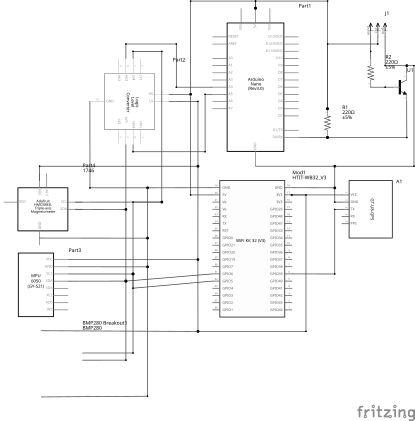
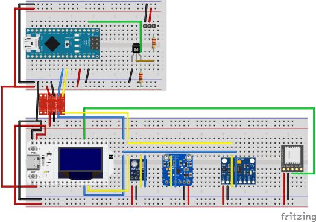
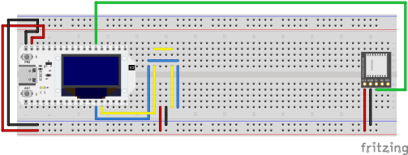
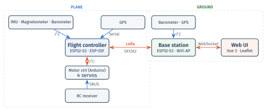

# Einleitung

"Auto Flight" ist ein autonomes Segelflugzeug, das vordefinierte Flächen (z. B. landwirtschaftliche Felder) selbstständig in einem Mäandermuster abfliegt. Die Navigation erfolgt über eine Kombination aus GPS, Beschleunigungssensor/Gyroskop (IMU), Magnetometer und Barometer. Das Flugzeug steht während des gesamten Flugs über eine Langstrecken-Funkverbindung (LoRa) mit einer Bodenstation in Kontakt, die eine Web-Oberfläche zur Missionsplanung und Live-Überwachung bereitstellt. Im Notfall kann das Flugzeug jederzeit über eine handelsübliche RC-Fernsteuerung manuell übernommen werden.

Das System besteht aus drei eigenständigen Firmware-/Software-Projekten (dem Flugcontroller im Flugzeug, der Bodenstation und einem Servo-/Motor-Controller) sowie einer Reihe geteilter Komponenten und Werkzeuge:

| Projekt | Plattform | Aufgabe |
|---|---|---|
| [`flight_controller/`](flight_controller) | ESP-IDF (ESP32-S3) | Hauptrechner im Flugzeug: Routenplanung, Sensorik, Flugregelung, LoRa-Kommunikation |
| [`base_station/`](base_station) | ESP-IDF (ESP32-S3) | Bodenstation: WLAN-Zugangspunkt, Web-UI-Server, LoRa-Relais |
| [`motor_controller/`](motor_controller) | PlatformIO/Arduino (ATmega328) | Steuerflächen-/Motoransteuerung, SBUS-Empfang, Sicherheits-Override |
| [`frontend_web/`](frontend_web) | Vue 3 + TypeScript | Bedienoberfläche der Bodenstation (Missionsplanung, Live-Telemetrie) |
| [`shared_components/`](shared_components) | ESP-IDF-Komponenten | Gemeinsame Bausteine für Flugcontroller und Bodenstation (LoRa, I2C, Sensor-Treiber, Datenhaltung) |

Das Projekt ist eine studentische Einzelarbeit im Modul "Mobile Roboter" und befindet sich im Status eines fortgeschrittenen Prototyps. Ein fortlaufendes Entwicklungsprotokoll mit Fortschritt und aufgetretenen Problemen findet sich in [`resources/learning.md`](resources/learning.md).

# Zielsetzung und Anwendungsszenario

## Grundidee

Ausgangspunkt des Projekts (siehe [`Projekt_Idee.md`](Projekt_Idee.md)) ist ein autonomes Segelflugzeug, das definierte Flächen abfliegt. Die im Rahmen dieser Arbeit umgesetzte Version deckt den Beginn dieses Szenarios ab: die Kommunikation mit der Bodenstation, die Konfiguration und die Überwachung des Flugs. Das Flugzeug ist bereits in der Lage, aus der vorgegebenen Fläche eine Route zu berechnen und kleine Korrekturen während des Fluges auf Basis des Beschleunigungssensors vorzunehmen. Das Anfliegen der Route erfolgt jedoch noch nicht vollständig autonom, da die Höhenregelung und die Schubregelung noch nicht flugerprobt sind.

## Anwendungsszenario
Das System ist für den Einsatz in der Kartografie und Landwirtschaft konzipiert. Bei einer Erweiterung um eine Kamera kann das System für die Inspektion von großen Flächen (z. B. landwirtschaftliche Felder, Solarparks, Wälder) genutzt werden. Die Bodenstation ermöglicht die Planung der zu überfliegenden Fläche, die Überwachung des Flugs und die Auswertung der Sensordaten. Das System ist für den Einsatz in ländlichen Gebieten mit geringer Bebauung und ohne Flugverbotszonen vorgesehen.

## Bandbreiten- und Datenhaltungskonzept

Da LoRa bei großer Reichweite nur eine sehr geringe Bandbreite bietet, ist die Funkstrecke bewusst auf kompakte Status- und Steuerdaten (Position, Sensorwerte, Routen, Verbindungsstatus) beschränkt. Größere Nutzdaten wie Kamerabilder sind in der ursprünglichen Idee für eine lokale Speicherung (SD-Karte) oder eine WLAN-Übertragung nach der Landung vorgesehen und bewusst nicht Teil der LoRa-Strecke. Dieser Teil ist im aktuellen Funktionsumfang nicht umgesetzt, da keine Kamera-Nutzlast integriert wurde.

# Anforderungen und Randbedingungen

## Funktionale Anforderungen

- Autonome Navigation entlang eines aus einem benutzerdefinierten Polygon berechneten Streifenmusters (Wegpunktfolge)
- Bestimmung von Position, Lage (Roll/Pitch), Kurs (Heading) und Höhe während des Flugs aus GPS, IMU, Magnetometer und Barometer
- Fernkonfiguration der Zielfläche und Überwachung des Flugs über eine Weboberfläche, erreichbar über einen von der Bodenstation bereitgestellten WLAN-Zugangspunkt
- Telemetrieübertragung (Position, wichtige Sensordaten, Verbindungsstatus, Route) über eine Langstreckenfunkverbindung zwischen Flugzeug und Bodenstation
- Jederzeitige manuelle Übersteuerbarkeit der Steuerflächen und des Antriebs über eine RC-Fernsteuerung, unabhängig vom Zustand des Flugcontrollers

## Nicht-funktionale Anforderungen und Randbedingungen

- **Reichweite vs. Bandbreite:** Die Funkstrecke muss auch über größere Entfernungen (Feldgröße) zuverlässig funktionieren. Das bedingt die Wahl von LoRa (868 MHz, ISM-Band) mit entsprechend geringer nutzbarer Datenrate und macht ein eigenes, sparsames Nachrichtenprotokoll notwendig (siehe Abschnitt "Technische Umsetzung").
- **Echtzeitfähigkeit:** Die Flugregelung läuft mit einer festen Zykluszeit von 50 ms, um auf Lage- und Kursänderungen zeitnah reagieren zu können.
- **Ressourcenbeschränkung:** Als Segelflugzeug ist Gewicht ein limitierender Faktor für Akkukapazität, Sensorik und Servos. Das begrenzt sowohl die Rechenleistung (Mikrocontroller statt Einplatinencomputer) als auch die Anzahl gleichzeitig betreibbarer I2C-Sensoren an einem gemeinsamen Bus.
- **Ausfallsicherheit:** Die manuelle Übersteuerung darf nicht vom Zustand des Flugcontrollers abhängen, da dieser die eigentliche Ausfallquelle ist, gegen die abgesichert werden soll.
- **Rechtlicher Rahmen:** Im Projektverlauf wurde eine Recherche zu rechtlichen Rahmenbedingungen für autonome Fluggeräte durchgeführt (siehe Woche 2 in [`resources/learning.md`](resources/learning.md)), die insbesondere die Notwendigkeit einer jederzeit verfügbaren manuellen Kontrolle bestätigt.

## Technische Randbedingungen

- Zwei baugleiche Heltec-WiFi-LoRa-32-V3-Boards (ESP32-S3 + integriertes SX1262-LoRa-Modul) als zentrale Rechen- und Funkeinheiten, eines im Flugzeug und eines in der Bodenstation
- Ein Arduino Nano (ATmega328) als separater, einfacher Servo-/Motor-Controller, angebunden über I2C an den Flugcontroller und über SBUS an den RC-Empfänger
- ESP-IDF (Version 5.x) als Firmware-Basis für Flugcontroller und Bodenstation, mit gemeinsam genutzten Komponenten in [`shared_components/`](shared_components)
- Node.js/Vue 3 für die Weboberfläche, die als statische Dateien in den Flash-Speicher der Bodenstation eingebettet wird (kein separater Webserver)

# Systemarchitektur

## Hardwarearchitektur

### Hauptkomponenten

| Komponente | Einsatzort | Funktion |
|---|---|---|
| Heltec WiFi LoRa 32 V3 (ESP32-S3 + SX1262) | Flugzeug, Bodenstation (2×) | Hauptrechner + LoRa-Funkmodul |
| Arduino Nano (ATmega328) | Flugzeug | Servo-/Motoransteuerung, SBUS-Empfang, Sicherheits-Override |
| GPS-Modul (ATGM336H, NMEA) | Flugzeug (Bodenstation optional) | Positionsbestimmung |
| MPU6050 (Beschleunigungssensor + Gyroskop) | Flugzeug | Lagebestimmung (Roll/Pitch) |
| Magnetometer HMC5883L | Flugzeug | Kursbestimmung (Heading) |
| Barometer (BME280) | Flugzeug, Bodenstation | Höhenbestimmung über Luftdruck |
| Level Shifter (3,3 V <-> 5 V) | Flugzeug | I2C-Pegelanpassung zwischen ESP32-S3 (3,3 V) und Arduino Nano (5 V) |
| Time-of-Flight-Sensor TOF200C | Flugzeug | Bodenabstandsmessung, vorgesehen für die automatische Landung |
| SBUS-Empfänger | Flugzeug | Empfang der RC-Fernsteuerbefehle |
| 4× Servo / ESC | Flugzeug | Querruder (differentiell), Höhenruder, Schub, Seitenruder |
| LittleFS-Speicher | Bodenstation | Ablage der Web-UI-Dateien im Flash |
| Akkus | Flugzeug, Bodenstation | Energieversorgung |

Die vollständige Stückliste befindet sich in [`BOM.md`](BOM.md). Der TOF200C-Abstandssensor ist Teil der Beschaffungsliste, aber im aktuellen Funktionsumfang noch nicht in die Firmware integriert, da die automatische Landung wie im Abschnitt "Bekannte Einschränkungen und mögliche Verbesserungen" beschrieben noch nicht umgesetzt ist.

Beim Magnetometer wurde ursprünglich ein QMC5883P eingesetzt und im Projektverlauf durch ein HMC5883L ersetzt. Beide zugehörigen Datenblätter liegen unter [`resources/`](resources) vor, der Grund für den Wechsel wird in Abschnitt "Technische Umsetzung und wesentliche Designentscheidungen" erläutert.

### Schaltpläne

Die Schaltpläne für Flugzeug und Bodenstation wurden mit [Fritzing](https://fritzing.org/) erstellt. Die Quelldateien liegen als [`assets/schematics_plane.fzz`](assets/schematics_plane.fzz) bzw. [`assets/schematics_base.fzz`](assets/schematics_base.fzz) vor, zusammen mit selbst angelegten Fritzing-Bauteilen für Module ohne offizielle Fritzing-Unterstützung ([BMP280-Breakout](<assets/BMP280_Breakout_Board.fzpz>), [GT-U8-GPS-Modul](<assets/GT-U8-GPS-module.fzpz>), [Heltec WiFi Kit 32 (V3)](<assets/Heltec WiFi Kit 32 (V3).fzpz>)).

**Flugzeug:**





**Bodenstation:**




### Mechanischer Aufbau

Unter [`3d_models/`](3d_models) liegen die 3D-gedruckten Gehäuse-/Montagekonstruktionen:

- **Bodenstations-Gehäuse** ([`base_station_case.scad`](3d_models/base_station_case.scad)): zweiteiliges Gehäuse (Wanne + Deckel) mit Snap-Fit-Verbindung, Aufnahmen für die Hauptplatine (Heltec LoRa32 V3 + GPS-Modul) und eine über Kabel angebundene Tochterplatine (Barometer), einer SMA-Antennendurchführung in der Gehäusewand sowie einem Druckausgleichsloch im Deckel oberhalb des Barometers.
- **Flugzeug-Montageplatte** ([`plane_mount_plate.scad`](3d_models/plane_mount_plate.scad)): laut Kommentar im Quellcode ein reines Layout-Mockup, das die relative Anordnung von Hauptplatine, zwei Tochterplatinen und den vier Steuerflächen-Servos zeigt. Es ist ausdrücklich kein flugtaugliches Bauteil (keine Rumpfbefestigung, keine Kabelkanäle, keine Gewichtsoptimierung).

### Systemtopologie



Die Steuerflächen können über die Servos sowohl vom Flugcontroller (über I2C) als auch direkt von der RC-Fernsteuerung (über SBUS) angesteuert werden. Welcher Pfad aktiv ist, entscheidet ausschließlich der Arduino im Flugzeug (siehe "Manuelle Übersteuerung").

## Softwarearchitektur

### Projektstruktur

| Pfad | Inhalt |
|---|---|
| [`flight_controller/`](flight_controller) | ESP-IDF-Firmware des Flugzeugs: Routenplanung, Sensorik, Flugregelung, LoRa-Kommunikation |
| [`base_station/`](base_station) | ESP-IDF-Firmware der Bodenstation: WLAN-AP, Web-UI-Server, LoRa-Relais |
| [`motor_controller/`](motor_controller) | Arduino-Firmware für Servo-/SBUS-Anbindung |
| [`frontend_web/`](frontend_web) | Vue-3-Weboberfläche der Bodenstation |
| [`shared_components/`](shared_components) | Zwischen Flugcontroller und Bodenstation geteilte ESP-IDF-Komponenten (LoRa, I2C, Sensor-Treiber, Datenhaltung) |
| [`python/`](python) | Offline-Visualisierung der berechneten Flugrouten |
| [`serial_plane_viz/`](serial_plane_viz) | Werkzeug zur Visualisierung der Servo-Ausschläge über die serielle Schnittstelle |
| [`doc/`](doc), [`resources/`](resources) | Notizen, Pinouts, Datenblätter, Stückliste, Entwicklungsprotokoll |

`flight_controller` und `base_station` sind zwei unabhängige ESP-IDF-Projekte mit jeweils eigener `sdkconfig`/`CMakeLists.txt`, die beide dieselben Komponenten aus `shared_components/` über `EXTRA_COMPONENT_DIRS` einbinden. Das ist die zentrale Wiederverwendungsstrategie des Projekts: Sensor-Treiber, I2C-Verwaltung, der LoRa-Funkstack und das Anwendungsprotokoll existieren nur einmal und werden von beiden Firmware-Projekten geteilt, gesteuert über ein projektweites Compile-Flag (`FLIGHT_DEVICE_TYPE_PLANE` bzw. `FLIGHT_DEVICE_TYPE_BASE_STATION`), das jeweils festlegt, welche Rolle ein Gerät im Protokoll einnimmt.
`motor_controller` ist ein eigenständiges Arduino-Projekt, das über I2C mit dem Flugcontroller kommuniziert und die Steuerflächen-Servos und den Motor ansteuert. Es ist bewusst einfach gehalten, da es nur die Aufgabe hat, die Servos zu bewegen und die SBUS-Signale der Fernsteuerung zu empfangen.

### Kommunikationsschichten

Die Verbindung zwischen Flugzeug und Bodenstation ist in drei Schichten aufgeteilt:

1. **Funkschicht** ([`shared_components/lora_com`](shared_components/lora_com)): Ansteuerung des SX1262-Funkmoduls über die RadioLib-Bibliothek. Da ein LoRa-Paket auf 255 Byte begrenzt ist, implementiert diese Schicht eine eigene Fragmentierung größerer Nachrichten (Kopf mit Nachrichten-ID, Fragment-ID und Gesamtfragmentzahl), eine Bestätigung jedes Fragments per ACK mit Zeitüberschreitung (2 s) und bis zu drei Wiederholungsversuchen, sowie periodische Keep-Alive-Pings (Standard: alle 30 s), um die Verbindung zu überwachen, falls keine andere Nachricht gesendet wird.
2. **Anwendungsprotokoll** ([`shared_components/flight_com`](shared_components/flight_com)): definiert typisierte Pakete auf Basis der Funkschicht, u. a. `SensorUpdate` (Luftdruck, Kurs), `PositionUpdate` (GPS-Position), `ComponentStatus` (Verbindungszustand der einzelnen Subsysteme, Override-Status, Flugzustand), `PlannedRoutePacket`/`PlannedAreaPacket` (berechnete Route bzw. vorgegebene Fläche) und `FlightHistoryPacket` (geflogene Strecke).
3. **Web-Anbindung** (Bodenstation -> Browser): Die Bodenstation übersetzt die empfangenen LoRa-Pakete nicht direkt weiter, sondern schreibt sie in einen zentralen, thread-sicheren Zustandsspeicher (`FlightStorage`, Teil von [`shared_components/flight_data`](shared_components/flight_data)). Ein HTTP-/WebSocket-Server liest daraus und serialisiert die Daten getrennt als JSON für das Web-Frontend. LoRa-Format und Web-JSON-Format sind damit vollständig entkoppelt.

### Web-Stack der Bodenstation

Die Bodenstation öffnet einen WLAN-AP (Standard-SSID, konfigurierbar über Kconfig, alternativ ein "Dev-Mode", in dem stattdessen erst versucht wird, sich mit einem bestehenden WLAN zu verbinden) sowie einen HTTP-Server. Dieser bedient:

- **Statische Dateien** der Weboberfläche aus einer LittleFS-Flash-Partition (`/*`-Route als Fallback-Handler). Das Verzeichnis `base_station/static` ist ein Symlink auf `frontend_web/dist`, sodass ein Frontend-Build direkt als Flash-Image eingebunden wird (`littlefs_create_partition_image` in [`base_station/CMakeLists.txt`](base_station/CMakeLists.txt)).
- **REST-API-Endpunkte**: u. a. `GET /api/status` (Verbindungsstatus), `POST`/`GET /api/area` (Zielfläche setzen/lesen), `GET /api/route` (berechnete Route abfragen). Details siehe "API-Referenz der Bodenstation" unten.
- **WebSocket-Endpunkt** (`GET /api/ws`): sendet alle 5 Sekunden drei Nachrichtentypen an alle verbundenen Clients: `flight` (Positionen, geplante/geflogene Route), `connection` (Verbindungszustände aller Subsysteme), `sensor` (Luftdruck, berechnete Höhe, Kurs). Details siehe unten.

### API-Referenz der Bodenstation

Sämtliche HTTP- und WebSocket-Endpunkte werden in der ESP-IDF-Komponente [`base_station/components/frontend`](base_station/components/frontend) registriert (`FrontendHandlerClass::init()`), nicht im `base_controller`. Beim Start wird zunächst `httpd_start` aufgerufen, dann die LittleFS-Partition gemountet und anschließend werden die Handler in fester Reihenfolge registriert: `/api/ping`, `/api/ws`, die übrigen REST-Endpunkte und zuletzt der statische Datei-Handler `/*`. Diese Reihenfolge ist notwendig, da `/*` als Wildcard sonst alle spezifischeren Routen verdecken würde. Parallel dazu startet ein FreeRTOS-Task, der alle 5 Sekunden Status-Pakete via WebSocket verschickt.

#### Datentypen

Alle Endpunkte tauschen JSON aus, das per `nlohmann::json` direkt aus den C++-Strukturen in [`FrontendPackets.hpp`](base_station/components/frontend/FrontendPackets.hpp) (de-)serialisiert wird. Die Typen im Frontend ([`frontend_web/src/types/`](frontend_web/src/types)) bilden dieselben Strukturen in TypeScript nach:

```ts
type Coordinate = { longitude: number; latitude: number }
type Route = Coordinate[]

type ConnectionState = "connecting" | "connected"
type FlightState = "planning" | "planned" | "flying" | "returning"

interface AreaDefinePacket {
  shape: Coordinate[]
}

interface PlannedRoutePacket {
  type: "plannedRoute"
  route: Coordinate[]
}

interface ConnectionUpdatePacket {
  type: "connection"
  baseConnectionState: ConnectionState
  lastContactBaseStationTimestamp: number
  planeConnectionState: ConnectionState
  lastContactPlaneTimestamp: number
  gpsConnectionBase: ConnectionState
  gpsConnectionPlane: ConnectionState
  barometerConnectionBase: ConnectionState
  barometerConnectionPlane: ConnectionState
  motorComConnectionPlane: ConnectionState
  magnetometerConnectionPlane: ConnectionState
  accelerometerConnectionPlane: ConnectionState
  manualOverridePlane: boolean
  flightState: FlightState
}

interface FlightUpdatePacket {
  type: "flight"
  basePosition: Coordinate
  basePositionUpdateTime: number
  planePosition: Coordinate
  planePositionUpdateTime: number
  flightRoute: Route
  flightRouteUpdateTime: number
  plannedRoute: Route
  plannedRouteUpdateTime: number
}

interface SensorUpdatePacket {
  type: "sensor"
  barometerPressureBase: number
  barometerPressurePlane: number
  calculatedAltitude: number
  headingPlane: number
}
```

`...Timestamp`/`...UpdateTime`-Felder sind Unix-Zeitstempel, die entweder aus der Laufzeit oder aus dem GPS-Signal stammen. `ConnectionState`/`FlightState` werden als Strings statt Zahlen serialisiert.

#### Endpunkte

| Methode | Pfad | Funktion | Typ |
|---|---|---|---|
| GET | `/api/ping` | Liveness-Check | Text `"pong"` |
| GET | `/api/ws` | WebSocket-Upgrade, Live-Telemetrie | siehe unten |
| GET | `/api/status` | Verbindungs- und Flugzustand | `ConnectionUpdatePacket` |
| POST | `/api/area` | Zielfläche setzen | Body: `AreaDefinePacket` |
| GET | `/api/area` | Zielfläche abfragen | `AreaDefinePacket` |
| GET | `/api/route` | Berechnete Route abfragen | `PlannedRoutePacket` |
| GET | `/*` | Statische Web-UI-Dateien aus LittleFS | — |

**WebSocket `/api/ws`**
Nach dem Upgrade wird der Client registriert und alle 5 Sekunden mit drei Nachrichten versorgt, unterschieden über `type`: `FlightUpdatePacket`, `ConnectionUpdatePacket`, `SensorUpdatePacket` (Typdefinitionen siehe oben). Sendet ein Client die Textnachricht `"ping"`, antwortet der Server mit `"pong"` (im Frontend als Verbindungs-Heartbeat genutzt). Der Typ der WebSocket-Nachricht wird aktuell über das erste Feld `type` im JSON-Objekt unterschieden, nicht über die WebSocket-Subprotokoll-Mechanismen.

### Frontend

Die Weboberfläche ([`frontend_web/`](frontend_web)) ist eine Vue-3-/TypeScript-Single-Page-Anwendung, gebaut mit Vite. Sie führt den Bediener über einen Assistenten durch die Missionsvorbereitung:

- **Verbindungsübersicht**: zeigt den Live-Status von Basis- und Flugzeugverbindung sowie deren Teilsysteme (GPS, Barometer, Motoransteuerung, Magnetometer) und gibt den nächsten Schritt erst frei, wenn alle Verbindungen stehen.
- **Flächenplanung**: Zeichnen eines Zielpolygons auf einer Leaflet-Karte (über `leaflet-draw`), Übertragung an die Bodenstation.
- **Routenvorschau**: Abfrage der vom Flugzeug berechneten Route, Darstellung auf der Karte zusammen mit der bisher geflogenen Strecke.
- **Live-Telemetrie**: laufende Aktualisierung von Position, Route und Sensorwerten über die WebSocket-Verbindung, ergänzt um einen eigenen Ping/Pong-Herzschlag im Frontend zur Erkennung von Verbindungsabbrüchen.

# Technische Umsetzung und wesentliche Designentscheidungen

## Routenplanung

Der [`route_planner`](flight_controller/components/route_planner) erzeugt aus einem vom Bediener gezeichneten Polygon ein Mäander- bzw. Boustrophedon-Muster:

1. **Sweep-Lines erzeugen**: Aus der Bounding-Box des Polygons werden äquidistante, horizontale Linien (parallel zum Breitengrad) im Abstand der effektiven Schwadbreite berechnet.
2. **Zuschneiden auf das Polygon**: Jede Linie wird mit dem tatsächlichen, auch konkaven, Polygon geschnitten (Geometriebibliothek [`homog2d`](https://github.com/skramm/homog2d)). Bei mehreren Schnittpunkten wird nur das äußere Segment behalten, sodass Löcher und konkave Formen korrekt ausgespart werden.
3. **Pfad zusammensetzen**: Die einzelnen Linien werden abwechselnd von links nach rechts bzw. rechts nach links zu einem durchgehenden Pfad verbunden. Zwischen zwei Zeilen werden zusätzliche Zwischenpunkte eingefügt, um statt einer scharfen 180°-Kehre eine weichere Kurvenbahn zu erzeugen.
4. **Interpolation**: Abschließend werden alle Teilstrecken, die länger als ein konfigurierter Maximalabstand sind, in gleichmäßige Zwischenpunkte unterteilt, sodass zwei aufeinanderfolgende Wegpunkte nie weiter als dieser Abstand auseinanderliegen. Diese Interpolation sollte später für die Kamerasteuerung verwendet werden können und ist nicht nur für die Flugregelung relevant.

In der aktuellen Implementierung ruft der Flugcontroller die Routenplanung mit einer maximalen Punktdistanz von 60 m, einer Schwadbreite von 40 m und einem Überlappungsfaktor von 20 % auf, was einem effektiven Zeilenabstand von 32 m entspricht. Diese Werte sind aktuell im Quellcode fest hinterlegt und nicht konfigurierbar. Für die spätere Integration einer Kamera würde dies mit der effektiven Bildbreite/FOV der Kamera, der Flughöhe und einer gewünschten zusätzlichen Überlappung zwischen den Bildern in Beziehung gesetzt werden, um die Parameter für die Routenplanung zu bestimmen.

## Flugregelung

Der Flugcontroller ([`FlightController`](flight_controller/components/flight_controller)) läuft als FreeRTOS-Task mit einem festen Zyklus von 50 ms und implementiert eine kaskadierte PI-Regelung für vier Steuergrößen:

- **Seitenruder (Kurs):** Aus der aktuellen GPS-Position und dem nächsten Wegpunkt wird die Soll-Peilung (Bearing) berechnet und mit dem gemessenen Kompasskurs verglichen. Der normalisierte Peilungsfehler wird proportional (P-Regelung) auf das Seitenruder abgebildet.
- **Höhenhaltung:** Die Differenz aus Zielhöhe (60 m) und gemessener Höhe treibt zwei parallele PI-Regelungen: eine für den Schub und eine für den Ziel-Pitch-Winkel, der wiederum als Sollwert in die Nickregelung einfließt (kaskadierte Regelung).
- **Querruder:** Reine "Wings-Level"-Regelung (PI auf den Rollwinkel), unabhängig vom Kurvenkommando. Es gibt aktuell keine koordinierte Kurve, das Abbiegen erfolgt ausschließlich über das Seitenruder.
- **Höhenruder:** PI-Regelung des Nickwinkels auf den von der Höhenregelung vorgegebenen Ziel-Pitch.

Die Wegpunkt-Erreichung wird über den Abstand zur aktuellen Position gegen einen konfigurierbaren Radius (Standard 30 m) geprüft. Ist der letzte Wegpunkt erreicht, wechselt der interne Flugzustand auf "Rückkehr". In der bisherigen Implementierung hat dies aber noch keinen Effekt. Reglerverstärkungen und Zielhöhe sind, anders als zum Beispiel Telemetrieintervall oder Wegpunktradius, als Konstanten im Quellcode hinterlegt statt als Kconfig-Parameter.

## Sensorik und Datenfusion

Die Sensordatenverarbeitung ist bewusst einfach gehalten: Es kommt **kein** gemeinsamer Zustandsschätzer zum Einsatz. Stattdessen wird jeder abgeleitete Messwert unabhängig über ein gleitendes Mittel geglättet und direkt in die jeweilige PI-Regelung eingespeist:

- **Lage (Roll/Pitch):** wird ausschließlich aus der Schwerkraftrichtung des Beschleunigungssensors berechnet (`atan2` über die Beschleunigungskomponenten), nach einer Nullpunktkalibrierung beim Start.
- **Kurs (Heading):** wird direkt aus den Magnetometer-Rohwerten berechnet (`atan2`), ohne Neigungskompensation gegenüber Roll/Pitch und ohne Korrektur der magnetischen Missweisung. Anschließend wird der Wert zirkulär geglättet (getrennte Mittelung von Sinus-/Kosinuskomponenten, um den Sprung bei 0°/360° korrekt zu behandeln).
- **Höhe:** aus dem barometrischen Luftdruck über die hydrostatische Grundgleichung, bezogen auf einen von der Bodenstation übermittelten Referenzdruck am Boden. Die berechnete Höhe ist somit relativ zum Startpunkt (AGL) und nicht absolut (MSL).
- **Position:** direkt aus geparsten GPS-NMEA-Sätzen, ohne zusätzliche Filterung oder Koppelnavigation. Eine Position gilt erst ab einer Mindestanzahl empfangener Satelliten als gültig.

Diese Architektur ist als pragmatischer Zwischenstand zu verstehen. Sie liefert brauchbare, aber gegenüber Vibrationen und kurzfristigen Störungen empfindlichere Schätzwerte als eine echte Sensorfusion (siehe "Bekannte Einschränkungen").

## Kommunikation Flugcontroller / Motor-Controller

Der Arduino-Motor-Controller ist I2C-Slave (Adresse `0x42`) mit einem bewusst minimalen, registerlosen Protokoll:

- **Schreiben (Flugcontroller → Arduino):** genau 4 Byte, je ein vorzeichenbehafteter Wert im Bereich -100…100 für Seitenruder, Höhenruder, Schub und differentielles Querruder. Unvollständige Übertragungen werden verworfen. Die zuletzt gültigen Werte bleiben erhalten.
- **Lesen (Arduino → Flugcontroller):** ein einzelnes Statusbyte, das anzeigt, ob der manuelle Override aktiv ist. Ein erfolgreicher Lesevorgang dient gleichzeitig als Verbindungsprüfung.

Der Arduino überwacht selbstständig die Aktualität eingehender I2C-Nachrichten und initialisiert den I2C-Bus automatisch neu, wenn eine Sekunde lang keine Nachricht eintrifft. Das ist eine Absicherung gegen hängende Bus-Zustände, die im Projektverlauf mehrfach beobachtet wurden.

## Manuelle Übersteuerung

Die sicherheitskritische Entscheidung, ob das Flugzeug autonom oder manuell gesteuert wird, ist bewusst nicht im Flugcontroller, sondern wird auf dem Arduino getroffen. Ein festgelegter SBUS-Kanal (Kanal 5) des RC-Empfängers wird als Override-Schalter interpretiert. Überschreitet sein Wert den Schwellwert von 1500 µs (Neutralstellung), steuert der Arduino die vier Servos direkt aus den SBUS-Kanälen an und ignoriert die zuletzt vom Flugcontroller empfangenen I2C-Werte. Der Flugcontroller selbst liest den Override-Status nur zu Anzeige-/Telemetriezwecken mit, hat aber keinen Einfluss darauf. Diese Entkopplung stellt sicher, dass die manuelle Kontrolle auch bei einem Absturz oder Hänger der ESP32-Firmware erhalten bleibt.

## Wesentliche Designentscheidungen im Projektverlauf

- **Wechsel von PlatformIO zu ESP-IDF** für Flugcontroller und Bodenstation (Woche 4 des Entwicklungsprotokolls): Auslöser waren Schwierigkeiten in der Komponentenverwaltung unter PlatformIO. ESP-IDF ermöglichte zudem, dieselben Komponenten nativ auf dem Host-Rechner zu bauen und zu testen (siehe "Tests und Evaluation").
- **Wechsel des Magnetometers von QMC5883P auf HMC5883L** sowie Umstellung des Auslesemodus von "Continuous" auf "Single-Read" (Wochen 10 und 11): Das ursprünglich verbaute QMC5883P antwortete unzuverlässig und teils unter wechselnden I2C-Adressen. Die tiefere Ursache eines wiederkehrenden Bus-Ausfalls wurde später identifiziert: Im kontinuierlichen Messmodus kann ein Lesezugriff während einer laufenden internen Messung den Sensor in einen Zustand versetzen, der den gesamten I2C-Bus blockiert bzw. mit Stördaten belegt, statt nur einen einzelnen fehlerhaften Messwert zu liefern. Die Umstellung auf einzeln angeforderte Messungen (Single-Read) behebt dieses Verhalten, da der Sensor Lesezugriffe erst nach Abschluss einer Messung zulässt.
- **Eigenes Fragmentierungsprotokoll über LoRa**: Da einzelne Anwendungsnachrichten (z. B. eine vollständige geplante Route) die maximale LoRa-Paketgröße von 255 Byte überschreiten können, wurde ein eigenes Fragmentierungs- und Bestätigungsschema mit Nachrichten-/Fragment-IDs, inspiriert von TCP, entwickelt.
- **Trennung von Funkprotokoll und Web-Protokoll**: Die bewusste Entkopplung von LoRa-Wireformat und WebSocket-/REST-JSON-Format über den zentralen `FlightStorage`-Zustandsspeicher erlaubt es, beide Seiten unabhängig voneinander weiterzuentwickeln.

## Begleitende Werkzeuge

Zwei Werkzeuge unterstützen die Entwicklung, sind aber nicht Teil der eigentlichen Flugsoftware:

- [`python/`](python): Zwei kleine Skripte zur Offline-Visualisierung der vom Routenplaner erzeugten Sweep-Pfade, als einfacher 2D-Plot (`matplotlib`) oder auf einer interaktiven Karte (`folium`).
- [`serial_plane_viz/`](serial_plane_viz): Ein Browser-Werkzeug (three.js), das Servo-Ausschläge (Motor, Roll, Pitch, Yaw), die über eine serielle Schnittstelle im selben Wertebereich wie das I2C-Protokoll des Motor-Controllers gesendet werden, an einem einfachen 3D-Flugzeugmodell visualisiert. Das ist nützlich zur Fehlersuche ohne reales Flugzeug.

# Tests und Evaluation

## Automatisierte Tests

**Flugcontroller (native Unit-Tests):** Das Build-System von `flight_controller` unterscheidet anhand einer Umgebungsvariable zwischen einem echten ESP-IDF-Firmware-Build und einem nativen Host-Build. Für Letzteren existiert ein eigener CMake-Kompatibilitäts-Layer, der ESP-IDF-Komponenten als gewöhnliche CMake-Bibliotheken für den Host kompilierbar macht, sodass die Geschäftslogik ohne reale Hardware getestet werden kann (GoogleTest). Inhaltlich beschränken sich die vorhandenen Tests ausschließlich auf die **Geometrie der Routenplanung**: korrekte Erkennung der äußeren Polygonpunkte, korrekte Schnittpunktberechnung zwischen Linie und Polygon, korrekte Anzahl/Lage der erzeugten Sweep-Lines sowie ein monotoner Verlauf des zusammengesetzten Sweep-Pfads. Es existieren **keine** automatisierten Tests für die Flugregelung (PI-Regler), die Sensor-Treiber oder das I2C-Protokoll zum Motor-Controller. Dieser Teil wird ausschließlich auf echter Hardware verifiziert.

**Frontend:** Typprüfung (`vue-tsc`) und Linting (ESLint/oxlint) laufen als Basis-Qualitätssicherung bei jedem Build. Ein Playwright-E2E-Grundgerüst ist eingerichtet. Der einzige vorhandene Test ist jedoch der unveränderte Gerüst-Test der Vue-Projektvorlage; reale Tests, die tatsächliche Funktionalität abdecken, wurden aufgrund der stetigen Veränderungen und Erweiterungen der Anwendung bisher nicht implementiert.

## Evaluation anhand des Entwicklungsverlaufs

Das Entwicklungsprotokoll ([`resources/learning.md`](resources/learning.md)) dokumentiert den Fortschritt über zwölf Wochen und erlaubt eine ehrliche Einschätzung des tatsächlich erreichten Funktionsstands:

- Erfolgreich umgesetzt und in Betrieb genommen wurden: GPS-Auswertung, eine funktionierende LoRa-Verbindung mit Bestätigungen und Keep-Alive-Pings, die I2C-Anbindung von Barometer und IMU sowi    e, nach den beschriebenen Hardware-Problemen, eine funktionsfähige Magnetometer-Anbindung.
- Mehrere grundlegende technische Probleme mussten während der Entwicklung gelöst werden, u. a. eine notwendige Paketfragmentierung für LoRa-Nachrichten über 255 Byte, ein Deadlock in der Event-Handler-Warteschlange sowie die oben beschriebenen I2C-Bus-Aussetzer im Zusammenhang mit dem Magnetometer.
- Wiederkehrende I2C-Bus-Instabilität beim gleichzeitigen Betrieb mehrerer Sensoren am selben Bus war das am längsten offene Hardware-/Firmware-Problem im Projektverlauf und ist auch bei den implementierten Workarounds (Bus-Recovery, Single-Read-Modus) als grundsätzliches Restrisiko zu betrachten.

# Bekannte Einschränkungen und mögliche Verbesserungen

**Sensorfusion:** Die Lagebestimmung erfolgt rein aus dem Beschleunigungssensor, ein Kalman- bzw. Komplementärfilter ist nicht aktiv, und der Kompass arbeitet ohne Neigungskompensation bzw. Deklinationskorrektur. Als Verbesserung sollten der vorhandene Komplementärfilter und die Gyroskop-Integration tatsächlich in die Regelschleife eingebunden sowie Neigungskompensation und Deklination im Heading ergänzt werden.

**Regelung:** Reglerverstärkungen und Zielhöhe sind hartkodiert statt konfigurierbar, es gibt keine koordinierte Kurve (Querruder unabhängig vom Kurvenkommando), und die volle Regelkaskade ist nicht flugerprobt. Verbessern ließe sich dies, indem die Gains über Kconfig bzw. zur Laufzeit konfigurierbar gemacht werden, systematische Flugtests durchgeführt werden und eine koordinierte Kurvenregelung ergänzt wird.

**Missionsparameter & Konfigurierbarkeit:** Schwadbreite, Überlappungsfaktor und maximale Punktdistanz sind für die Routenplanung fest im Quellcode hinterlegt (siehe Abschnitt "Routenplanung") und nicht konfigurierbar, um sie auf unterschiedliche Kameras (FOV, Modell), Akkukapazitäten oder Flugzeuggrößen/-gewichte abzustimmen; ebenso fehlt jegliche Konfiguration für den koordinierten Betrieb mehrerer Flugzeuge (Schwarmkonfiguration). Sinnvoll wäre es, diese Missionsparameter über die Weboberfläche konfigurierbar zu machen und die Kommunikations-/Adressierungsschicht (siehe "Funkstrecke") so zu erweitern, dass mehrere Flugzeuge und Basisstationen als Schwarm koordiniert werden können.

**Pfadplanungsalgorithmen:** Aktuell ist ausschließlich ein Sweep-Line-Mäandermuster implementiert; alternative Coverage-Path-Planning-Algorithmen wurden nicht durchgetestet oder evaluiert. Eine systematische Evaluation verschiedener Algorithmen anhand von Flugstrecke, theoretischer Flugdauer und geschätzter Akkukapazität stünde noch aus und wäre ein sinnvoller nächster Schritt, um die Routenplanung über die reine Geometrie hinaus energie- und laufzeitbewusst zu machen.

**Hardware-Robustheit:** Bei mehreren angeschlossenen Sensoren treten wiederkehrende I2C-Bus-Aussetzer auf, die trotz Workarounds ein Restrisiko darstellen. Als Verbesserung bietet sich an, die Bus-Topologie zu überdenken (z. B. I2C-Multiplexer, getrennte Busse) und ein Hardware-Redesign der Verkabelung vorzunehmen.

**Funkstrecke:** Es ist keine Verschlüsselung aktiv, es gibt keine Geräteadressierung (nur Punkt-zu-Punkt, relevant für mehrere Flugzeuge/Basisstationen), und die Sendezeit-Regelung ist nicht kontrolliert. Verbesserungspotenzial liegt in der Aktivierung von Verschlüsselung, der Ergänzung einer Adressierung für Mehrflugzeug-Szenarien und der Implementierung einer Kontrolle der maximalen Sendezeit.

**Testabdeckung:** Nur die Routenplanungs-Geometrie ist automatisiert getestet, die CI baut ausschließlich die Dokumentation und nicht die Firmware bzw. das Frontend, und der Frontend-E2E-Test ist unveränderter Gerüst-Code. Hier sollten Unit-Tests für Regelungslogik und Protokollcode ergänzt, Firmware-/Frontend-Build und Tests in die CI-Pipeline aufgenommen und der Playwright-Test an die reale Anwendung angepasst werden.

**Frontend-Code:** Das Frontend ist noch nicht fertiggestellt. Es fehlen noch Möglichkeiten zur weiteren Konfiguration der Flugstreckenberechnung, die Flugüberwachung, sobald der Flug gestartet wurde, sowie ein Return-to-Home. Aktuell gibt es auch noch ein Problem mit dem Laden der Tiles für die OpenStreetMap-Karte. Da sich das Endgerät im WLAN der Basisstation befindet und diese keinen Internetzugriff bietet, funktioniert die Kartenansicht aktuell nur, wenn ein eigener Hotspot aufgemacht wird oder man zwischenzeitig auf mobile Daten wechselt, um die Karte zu laden. Als Lösung für dieses Problem bietet sich ein SIM-Modul an. Alternativ wäre der Wechsel zu einer nativen App mit Kommunikation per Bluetooth eine elegante Variante, die es ermöglichen würde, die Offline-Karten des Mobiltelefons zu verwenden.

**Flugtests:** Es wurden keine echten Flugtests durchgeführt, da Höhenregelung und Schubregelung noch nicht adäquat implementiert sind; zudem sind die bisherigen Servo-Regelungen noch zu kontrollieren. Als nächster Schritt sollten systematische Flugtests durchgeführt werden, ggf. mit Sicherheitsleine oder in einem abgesperrten Testbereich.

**Kameraeinbindung:** Bisher wurde die Kamera in diesem Prototypen außen vor gelassen. Die Bildabdeckung ist zwar über FOV und Bodendistanz berechenbar, eine zuverlässige Bodendistanzmessung fehlt aber noch: Barometer und GPS liefern nur die Höhe über Startpunkt/Meeresspiegel und versagen in hügeligem bzw. bergigem Gelände ohne begleitende Höhenkarte, ein LiDAR-Sensor für Reichweiten über 40 m wäre hierfür ebenfalls noch zu ergänzen. Für eine Bildverarbeitung existiert die Idee der Feuer-/Raucherkennung. Hierfür könnte versucht werden, auf einem ESP ein kleines quantisiertes CNN laufen zu lassen (inspiriert von dem Projekt [ESP32 LLM](https://github.com/DaveBben/esp32-llm)). Als naive, ressourcenschonendere Alternative dazu käme ein einfacher heuristischer Algorithmus in Frage (z. B. Grau-/Rotanteil im Bild, optional unterstützt durch eine Wärmebildkamera). Nächste Schritte wären die Anbindung einer echten Kamera an diesen ESP32-Prototypen, die Integration in den Gesamtprozess (Flugcontroller/Bodenstation) sowie ein vergleichender Test beider Ansätze (naiv vs. CNN) hinsichtlich Erkennungsgüte und Ressourcenverbrauch.

# Individuelle Beiträge

Das Projekt wurde als Einzelarbeit umgesetzt (ein Autor laut Aufgabenstellung und Versionskontrolle). Konzeption, die gesamte Firmware-Entwicklung (Flugcontroller, Bodenstation, Motor-Controller), die Entwicklung der Weboberfläche, die Auswahl und Integration der Hardware sowie diese Dokumentation stammen vollständig von derselben Person. Eine Aufteilung auf mehrere Bearbeiter entfällt entsprechend.
Es wurden in kleinem Maße KI-Tools zur Unterstützung beim Refactoring oder bei der Entwicklung der 3D-Visualisierung genutzt. Die wesentlichen Teile der Softwareentwicklung, insbesondere auch das Systemdesign, die Systemstruktur und die Systemlogik, wurden jedoch ohne KI umgesetzt.
